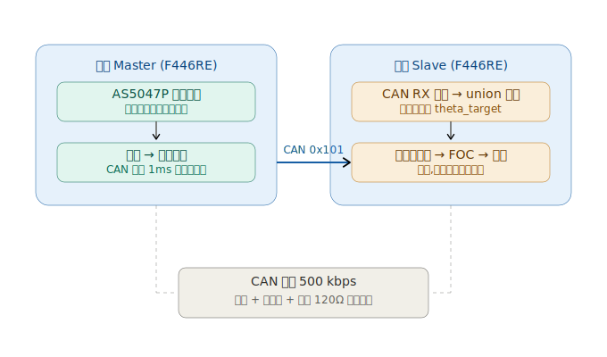
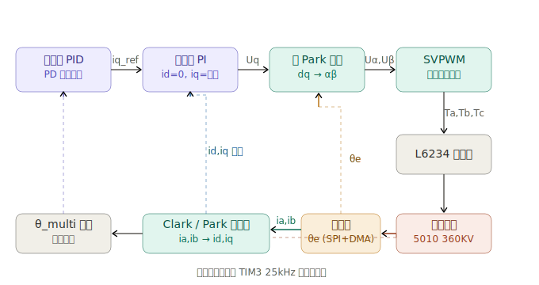

# STM32F446 分布式 FOC 关节驱动器

基于双 STM32F446RE 的分布式电机控制系统,从零手写实现三环级联 FOC(磁场定向控制),并通过 CAN 总线组成主从架构,验证人形机器人多关节分布式控制的核心技术链路。

**已实现:**

- **三环级联 FOC**:手写 Clark/Park 变换 + SVPWM 共模注入调制,电流环 / 速度环 / 位置环逐层闭合,实现位置伺服("指哪打哪")。
- **CAN 分布式主从**:主板手拧编码器作为输入,经 CAN 总线下发目标角度;从板接收后用三环位置环跟随,支持多圈累加与顺逆双向联动。
- **全程裸 HAL + CubeMX 手写**,不依赖 SimpleFOC 等现成库,底层时序、采样、编码器读取、控制环全部自己实现。

**技术栈:** STM32F446RE · STM32CubeIDE/CubeMX · HAL · SVPWM · FOC · SPI(DMA)· ADC(TRGO同步)· CAN(bxCAN)· VOFA+

---

## 文档导航

| 文档 | 内容 |
|---|---|
| 本页 | 项目概览、系统架构、硬件平台、快速运行 |
| [docs/TECHNICAL.md](./docs/TECHNICAL.md) | 核心技术实现:SVPWM 共模注入 / 谷底同步采样 / 编码器校准对齐 / θe 中断同步 / 三环 PD 直控 / CAN 协议 |
| [docs/DEBUGGING.md](./docs/DEBUGGING.md) | 工程调试与问题解决:8 个典型问题的"现象 → 根因 → 解决"全过程 |
| [LEARNING_LOG.md](./LEARNING_LOG.md) | 完整学习历程与迭代记录 |

---

## 演示

[▶️ 双板 CAN 分布式跟随演示](./docs/demo.mp4)(28 秒)

手拧主板电机转子,从板电机通过 CAN 实时跟随同步转动;VOFA+ 同步显示主从两路角度曲线,可见从板紧密跟踪主板,支持多圈、顺逆双向。

---

## 系统架构

### 分布式主从架构(系统级)

主板与从板烧录同一套 FOC 固件,仅靠角色配置(发送 / 接收)区分主从——主板读自身编码器作为"手轮"输入,经 CAN 总线(0x101,500kbps)下发目标角;从板接收后用三环位置环跟随。两板共地、双绞线、总线两端各接 120Ω 终端电阻。



### 三环级联控制(控制级,主从共用的内核)

所有控制运算在 TIM3 25kHz 中断内完成。位置环输出电流指令 → 电流环 PI 输出 dq 电压 → 逆 Park 变换 → SVPWM 共模注入 → L6234 三相桥 → 电机。反馈链路:INA240 + ADC 谷底同步采样得相电流(Clark/Park 正变换 → id/iq),AS5047P 经 SPI+DMA 读电角度 θe。



> 控制环与算法细节见 [docs/TECHNICAL.md](./docs/TECHNICAL.md)。

---

## 硬件平台

双板配置完全相同,每块板构成一个独立关节单元:

| 模块 | 型号 | 关键参数 |
|---|---|---|
| 主控 MCU | STM32F446RE (Nucleo-64) | 180MHz,硬件 FPU,板载 ST-Link |
| 三相驱动 | MKS SimpleFOC Shield V2.0.4 | L6234 单芯片三相桥,2A 持续 / 5A 峰值 |
| 电流采样 | INA240A2 | 增益 50,10mΩ 分流电阻,inline 采样 |
| 磁编码器 | AS5047P | 14 位绝对式,SPI 接口 |
| 电机 | 5010 无刷电机 360KV | 7 对极,12 槽 14 极 |
| 通信 | TJA1050 | CAN 收发器,500 kbps |
| 电源 | KUAIQU SPS-E305 | 双路 30V/5A 可调,CC 限流 |

### 关键引脚分配

| 功能 | 引脚 | 说明 |
|---|---|---|
| 三相 PWM | PC7 / PB4 / PB10 | TIM3_CH2 / TIM3_CH1 / TIM2_CH3,中心对齐 25kHz |
| 编码器 SPI | PA5 / PA6 / PA7 | SCK / MISO / MOSI(Mode 1) |
| 编码器片选 | PB6 | CSn |
| 电流采样 | PA0 / PA4 | ADC1_IN0 / IN4,TIM3 TRGO 同步触发 |
| 驱动使能 | PA9 | EN_GATE |
| CAN | PA11 / PA12 | RX / TX (AF9) |
| 调试串口 | PA2 / PA3 | USART2,115200,接 VOFA+ |

> ⚠️ PA5 是 SPI1_SCK,被复用占用,板载 LD2 LED 不可用。

### 关键选型考量

- **MCU 选 F446 而非 F103**:F103 无硬件 FPU,FOC 的浮点三角运算软件模拟需 30~50μs,无法塞进 25kHz 控制中断;F446 带单精度硬件 FPU,同样运算降到几 μs,中断预算充足。
- **编码器选 AS5047P 而非 AS5600**:AS5600 走 I2C,单次读取 400~800μs,跟不上高带宽电流环;AS5047P 走 SPI 高速读取,14 位分辨率满足关节定位精度。
- **驱动板必须带电流采样**:无电流采样就无法闭合电流环——而电流环是 FOC 的内核,这是选 SimpleFOC Shield(板载 INA240 inline 采样)而非无采样廉价板的根本原因。
- **电源选双路独立可调限流**:CC 限流模式可在代码 bug 时保护驱动板不被烧;双路独立供电匹配双板分布式架构,一路异常不影响另一路。

---

## 工程结构与运行

### 仓库结构

```
STM32-Distributed-FOC-Joint/
├── Core/  Drivers/  *.ioc   # 从板工程(三环 FOC + CAN 接收跟随,位于根目录)
│   └── Core/Src/main.c      # 从板核心代码(FOC运算、中断、CAN回调)
├── master/                  # 主板工程(编码器读取 + CAN 发送目标角)
│   └── Core/Src/main.c      # 主板核心代码
├── docs/                    # 技术文档、调试文档、架构图、演示视频
├── LEARNING_LOG.md          # 学习历程
└── README.md
```

主板与从板是两个独立的 STM32CubeIDE 工程,共用同一套 FOC 底层,仅角色不同(主板发送、从板接收执行)。从板工程位于仓库根目录,主板工程位于 master/ 子文件夹。

### 开发环境

STM32CubeIDE + CubeMX + HAL 库,STM32F446RE。可视化用 VOFA+(FireWater 协议,USART2 @ 115200)。

### 运行步骤

1. 用 STM32CubeIDE 分别打开 `slave/` 和 `master/` 工程,编译并烧录到对应的两块 Nucleo-F446RE。
2. 接线:两板 CAN_H / CAN_L 经 TJA1050 互联,共地,总线两端各接 120Ω 终端电阻。
3. 上电顺序:先接 USB,再开电源(电源限流先设 0.5A,确认正常后放到 1.5~2A)。
4. 从板上电后会先执行编码器零位校准(听到"咔"一声对齐),随后进入位置环待命。
5. 手拧主板电机转子,从板电机即通过 CAN 跟随转动。

> ⚠️ 关机顺序:先关电源,再拔 USB。两板必须共地。

---

## 后续优化方向

- **补充量化性能测试**:目前以功能验证为主,后续补测位置稳态误差、阶跃响应时间、CAN 端到端延迟等量化指标。
- **ω·Ts 动态相位预测**:当前相位补偿 `theta_comp` 是开环正转下标定的固定值,只能补偿一个转向;反向时延迟符号相反,导致方向相关抖动。已定位根因(`θe_err = ωe·T_delay`,符号随转向变),后续用速度估计做动态补偿,双向自适应。
- **裸寄存器 DMA 双缓冲**:当前 SPI 编码器读取基于 HAL + 错误自愈,可升级为裸寄存器双缓冲,时序更优雅、无需自愈兜底。
- **L3 力矩反馈闭环**:从板经 CAN 回传 iq 给主板(报文 0x201 已预留),实现双向力反馈。难点不在通信,而在双位置环对拧的稳定性(需引入虚拟阻尼)。
- **断电位置记忆**:多圈累加角软件维护,断电丢失;可用带电池的多圈绝对编码器或 Flash 存储解决。

---

> 本项目以学习与验证为目标,从零手写实现,代码迭代过程完整保留在 commit 历史中。
